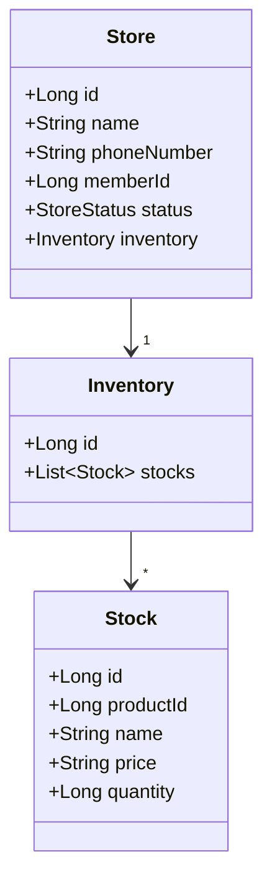

# Store & Inventory Microservice

> **Purpose –** Handles **store onboarding**, **inventory & stock management**, and keeps product data in sync via Kafka events for the **OrderHub** platform.

This service is the single source of truth for what each physical/online store owns and the real‑time quantity of every product SKU.

---

## ✨ Key Features

| Domain              | Capability                                                                                                                              |
| ------------------- | --------------------------------------------------------------------------------------------------------------------------------------- |
| **Store**           | CRUD for merchant stores. Soft‑close via `StoreStatus.CLOSED`.                                                                          |
| **Inventory**       | One inventory per store, created automatically.                                                                                         |
| **Stock**           | Add / update units, automatic quantity increment. Maintains per‑store sale price & name snapshot.                                       |
| **Event Listeners** | *Product Update* → propagates name/price changes to all inventories. <br>*Inventory Deduct* → decrements stock when an order is placed. |
| **Auditing**        | `createdAt` / `updatedAt` auto‑populated (`@PrePersist`, `@PreUpdate`).                                                                 |

---

## 🏗️ Tech Stack

| Layer          | Technology                            |
| -------------- | ------------------------------------- |
| Language       | **Kotlin 1.9**                        |
| Framework      | Spring Boot 3, Spring Data JPA        |
| Persistence    | **MySQL 8**                           |
| Messaging      | **Apache Kafka** (spring‑kafka)       |
| Build / DevOps | Gradle 8, Docker & Compose            |
| Testing        | JUnit 5, Testcontainers‑MySQL & Kafka |

---

## ⚙️ Architecture

```
┌────────────┐    REST/JSON     ┌─────────────────┐
│   Client   │ ───────────────▶│ Store API       │
└────────────┘                 │  Controller     │
                               └────────┬────────┘
                                        ▼
                               ┌──────────────────┐
                               │ Service Layer    │
                               └────────┬─────────┘
                                        ▼
                               ┌──────────────────┐
                               │ Domain Model     │
                               └──────┬───────────┘
                                        ▼ DAO
                               ┌──────────────┐
                               │ Repository   │
                               └──────────────┘

            ▲ product-updated / inventory-deduct Kafka topics ▲
            └─────────────────────── Event Listeners ─────────┘
```

---

## 📚 Domain Model Highlights



---

## 🔌 REST API Sketch

> **Base path** `/api/v1`

| Method | Path           | Description                             |
| ------ | -------------- | --------------------------------------- |
| GET    | `/stores`      | List all stores                         |
| GET    | `/stores/{id}` | Store detail (with inventory)           |
| POST   | `/stores`      | Create store (auto‑creates inventory)   |
| PATCH  | `/stores/{id}` | Update mutable fields                   |
| DELETE | `/stores/{id}` | Close store (sets `StoreStatus.CLOSED`) |

---

## 🚀 Getting Started

```bash
git clone https://github.com/orderhub/store-service.git
cd store-service

# spin up MySQL & Kafka
docker compose up -d mysql kafka zookeeper

# build & run
./gradlew bootRun
```

Service lives at **[http://localhost:8081](http://localhost:8081)** (default).

---

## 🧪 Tests

```bash
./gradlew test                      # unit tests
TESTCONTAINERS=true ./gradlew check  # integration tests with MySQL+Kafka
```

---

## 📦 Deployment

* **Docker** image built via Jib: `./gradlew jibDockerBuild`
* Kubernetes manifests under `deploy/` helm chart.

---

## ✉️ Event Contracts

| Topic              | Key       | Value (JSON)                                           | Producer        |
| ------------------ | --------- | ------------------------------------------------------ | --------------- |
| `product-updated`  | productId | `{"productId":123,"name":"New","price":"1000"}`        | product‑service |
| `inventory-deduct` | storeId   | `{"storeId":10,"items":[{"itemId":123,"quantity":2}]}` | order‑service   |

Listeners log failures and do **not** commit offset until processing succeeds, ensuring at‑least‑once semantics.

---

## © 2025 OrderHub
